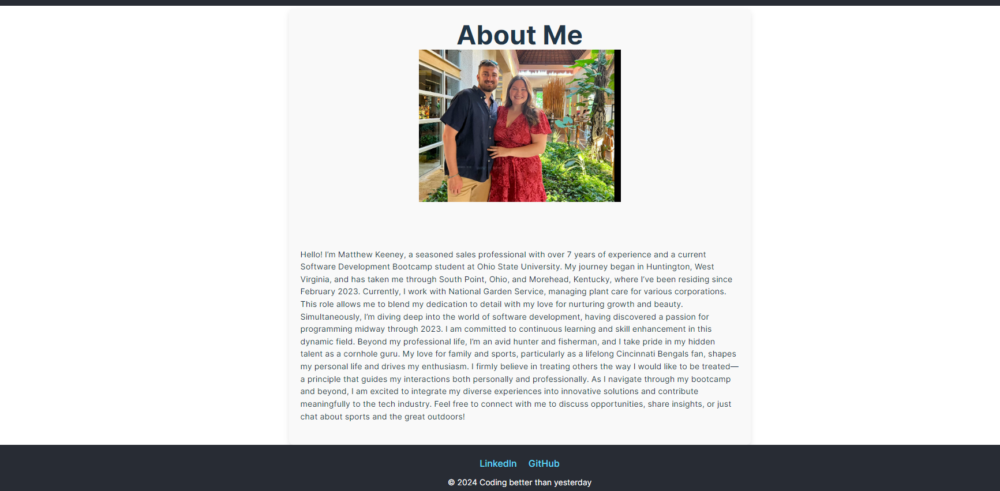

# React Portfolio

## Description
The React Portfolio is a single-page application designed to showcase a web developer's skills, projects, and contact information. Built using React, this portfolio allows users to navigate through various sections, including About Me, Portfolio, Contact, and Resume, all while maintaining a responsive and visually appealing design. This project demonstrates the use of modern web development practices and tools.

## Table of Contents
User Story
Acceptance Criteria
Mock-Up
Getting Started
Projects
Design
Grading Requirements
Review
User Story
md
Copy code
AS AN employer looking for candidates with experience building single-page applications
I WANT to view a potential employee's deployed React portfolio of work samples
SO THAT I can assess whether they're a good candidate for an open position
Acceptance Criteria
md
Copy code
GIVEN a single-page application portfolio for a web developer
WHEN I load the portfolio
THEN I am presented with a page containing a header, a section for content, and a footer
WHEN I view the header
THEN I am presented with the developer's name and navigation with titles corresponding to different sections of the portfolio
WHEN I view the navigation titles
THEN I am presented with the titles About Me, Portfolio, Contact, and Resume, and the title corresponding to the current section is highlighted
WHEN I click on a navigation title
THEN the browser URL changes and I am presented with the corresponding section below the navigation and that title is highlighted
WHEN I load the portfolio the first time
THEN the About Me title and section are selected by default
WHEN I am presented with the About Me section
THEN I see a recent photo or avatar of the developer and a short bio about them
WHEN I am presented with the Portfolio section
THEN I see titled images of six of the developer’s applications with links to both the deployed applications and the corresponding GitHub repositories
WHEN I am presented with the Contact section
THEN I see a contact form with fields for a name, an email address, and a message
WHEN I move my cursor out of one of the form fields without entering text
THEN I receive a notification that this field is required
WHEN I enter text into the email address field
THEN I receive a notification if I have entered an invalid email address
WHEN I am presented with the Resume section
THEN I see a link to a downloadable resume and a list of the developer’s proficiencies
WHEN I view the footer
THEN I am presented with text or icon links to the developer’s GitHub and LinkedIn profiles, and their profile on a third platform (Stack Overflow, Twitter)
Mock-Up

## Getting Started
To set up and run this project locally, follow these steps:

In the command line, navigate to the desired parent folder and run:

bash
Copy code
npm create vite
Choose the project name and select React as the framework and JavaScript as the variant.

Change into the project directory:

bash
Copy code
cd your-project-name
Install dependencies:

bash
Copy code
npm install
Run the development server:

bash
Copy code
npm run dev
Additional Configuration
Modify the scripts in package.json to include:

json
Copy code
"scripts": {
  "dev": "vite",
  "start": "vite",
  "build": "vite build",
  "lint": "eslint src --ext js,jsx --report-unused-disable-directives --max-warnings 0",
  "preview": "vite preview"
}
Update vite.config.js to:

js
Copy code
export default defineConfig({
  plugins: [react()],
  server: {
    port: 3000,
    open: true
  }
});

## Projects
Each project in the portfolio should include:

An image (GIF or screenshot) of the deployed application.
The project title.
Links to the deployed application and GitHub repository.
Design
Ensure the portfolio is polished and visually appealing:

Utilize a mobile-first design.
Choose a distinctive color palette.
Ensure readability with appropriate font sizes and contrasting colors.
Consider animations and component libraries to enhance the user experience.
Grading Requirements
The project will be graded based on the following criteria:

Technical Acceptance (40%): Meeting all acceptance criteria using React components.
Deployment (32%): Application must be deployed on Netlify with no loading errors.
Application Quality (15%): User experience should be intuitive, and the UI should be clean.
Repository Quality (13%): Follow best practices for file structure, naming conventions, and documentation.
Review
Submit the following for review:

The URL of the deployed application.
The URL of the GitHub repository with a unique name and a detailed README.